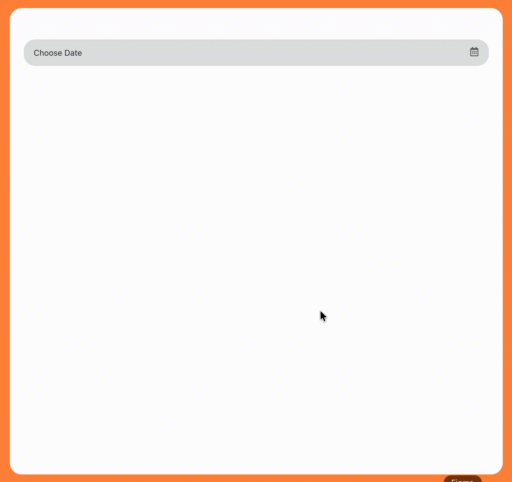

# React Calendar Component

<div align="center">
  


**Customizable React Calendar Component with TypeScript support**

[](https://github.com/TamarCoder/react-calendar-component)
[](https://opensource.org/licenses/MIT)

[Features](#-features) • [Installation](#-installation) • [Usage](#-usage) • [Documentation](#-component-architecture)

</div>

---

## ✨ Features

- 🎨 **Fully Customizable** - Easy to style with SCSS modules
- 📱 **Responsive Design** - Works on all screen sizes
- 🔧 **TypeScript Support** - Full type definitions included
- 📅 **Month Navigation** - Intuitive ← → navigation
- 🎯 **Today Highlight** - Current day automatically highlighted
- ✅ **Selection State** - Clear visual feedback on selected date
- 🖱️ **Click Outside** - Auto-closes when clicking outside calendar
- 🌍 **i18n Ready** - Easy to translate month/day names
- 📦 **Lightweight** - Minimal dependencies

---

## 🚀 Installation

```bash
npm install react react-icons
```

**Required Dependencies:**
- React 18+
- react-icons (FaRegCalendarAlt, TiArrowLeftThick, TiArrowRightThick)

---

## 💡 Usage

### Basic Example:
```tsx
import Calendar from './components/Calendar/Calendar';

function MyForm() {
  const [selectedDate, setSelectedDate] = useState<Date | null>(null);

  return (
    <Calendar
      label="Birth Date"
      initialDate={new Date()}
      onChange={(date) => setSelectedDate(date)}
    />
  );
}
```

### Integration with React Hook Form:
```tsx
import { Controller } from 'react-hook-form';

<Controller
  name="birthDate"
  control={control}
  render={({ field }) => (
    <Calendar
      label="Select Date"
      initialDate={field.value}
      onChange={field.onChange}
    />
  )}
/>
```

---

## 🎯 Props

| Prop | Type | Required | Description |
|------|------|----------|-------------|
| `label` | `string` | No | Calendar label text |
| `initialDate` | `Date` | No | Initial selected date |
| `minDate` | `Date` | No | Minimum allowed date (future feature) |
| `maxDate` | `Date` | No | Maximum allowed date (future feature) |
| `onChange` | `(date: Date) => void` | No | Callback function when date is selected |

---

## 🧠 Component Architecture

### State Management (3 States)

```tsx
const [selectedDate, setSelectedDate] = useState<Date | null>(null);
const [currentMonth, setCurrentMonth] = useState<Date>(new Date());
const [isOpen, setIsOpen] = useState(false);
```

1. **`selectedDate`** - Which date is selected by user
2. **`currentMonth`** - Which month is currently being viewed
3. **`isOpen`** - Whether calendar popup is open or closed

---

### Click Outside Detection

Uses `useRef` and `useEffect` to detect clicks outside the calendar and automatically close the popup:

```tsx
const calendarRef = useRef<HTMLDivElement>(null);

useEffect(() => {
  const handleClickOutside = (event: MouseEvent) => {
    if (calendarRef.current && !calendarRef.current.contains(event.target as Node)) {
      setIsOpen(false);
    }
  };
  document.addEventListener("mousedown", handleClickOutside);
  return () => document.removeEventListener("mousedown", handleClickOutside);
}, []);
```

---

## 🎨 Customization

### Change Month Names:
```tsx
const getMonthName = (date: Date): string => {
  const months = [
    "Jan", "Feb", "Mar", "Apr", "May", "Jun",
    "Jul", "Aug", "Sep", "Oct", "Nov", "Dec"
  ];
  return months[date.getMonth()];
};
```

### Change Weekday Names:
```tsx
const renderWeekDay = () => {
  const days = ["Mon", "Tue", "Wed", "Thu", "Fri", "Sat", "Sun"];
  return days.map((day) => (
    <div key={day} className={styles.weekDay}>{day}</div>
  ));
};
```

### Customize Styles:
All styles are in `Calendar.module.scss` - easily customize:
- Colors
- Border radius
- Fonts
- Spacing
- Animations

---

## 📚 Key Concepts

### How Days in Month is Calculated:
```tsx
const getDayInMonth = (date: Date): number => {
  return new Date(date.getFullYear(), date.getMonth() + 1, 0).getDate();
};
```
**JavaScript trick:** Day 0 of next month = Last day of current month!

### Grid Layout:
```scss
.daysGrid {
  display: grid;
  grid-template-columns: repeat(7, 1fr);  // 7 columns for 7 days
  gap: 4px;
}
```

---

## 🚀 Future Improvements

- ✅ Min/Max date validation
- ✅ Disabled days
- ✅ Range selection (from-to)
- ✅ Multiple month display
- ✅ Full i18n support
- ✅ Keyboard navigation
- ✅ Accessibility (ARIA labels)

---

## 📝 License

MIT License - Free to use in personal and commercial projects.

---

## 👨‍💻 Author

Created by **Tamar Khuskivadze**

[](https://github.com/TamarCoder)

---

## ⭐ Show Your Support

If you like this project, please give it a ⭐ on [GitHub](https://github.com/TamarCoder/react-calendar-component)!

---

**[📖 Full Documentation (Georgian)](./README.ka.md)**
